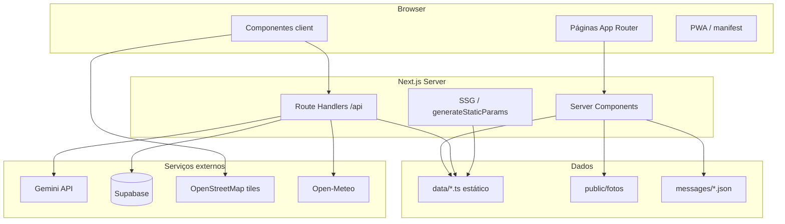

# Arquitetura

Visão geral de como o **Descubra Aracaju** está organizado e como os dados fluem entre camadas.

---

## Diagrama geral



---

## App Router e i18n

- Todas as páginas públicas ficam em `app/[locale]/`.
- O **middleware** (`middleware.ts`) detecta idioma e redireciona conforme `i18n/routing.ts`.
- **Português** é o locale padrão, sem prefixo na URL (`/`, `/ranking`).
- **Inglês** e **espanhol** usam prefixo (`/en/ranking`, `/es/ranking`).

### Layout

| Arquivo | Responsabilidade |
|---------|------------------|
| `app/layout.tsx` | Shell mínimo (pass-through) |
| `app/[locale]/layout.tsx` | `<html>`, fontes, Header, Footer, BottomNav, Chat |

---

## Duas camadas de tradução

### 1. Interface (UI)

Textos de botões, menus, títulos → `messages/pt.json`, `en.json`, `es.json`.

Uso: `useTranslations("nav")` (client) ou `getTranslations("home")` (server).

### 2. Conteúdo (lugares)

Cada **ponto turístico** tem campos traduzidos de duas formas complementares:

| Origem | Padrão |
|--------|--------|
| Aracaju (`data/pontos.ts`) | Texto PT inline + overlays EN/ES em `data/i18n-aracaju.ts` |
| São Cristóvão (`data/pontos-sc.ts`) | Trilingual inline com helper `L(pt, en, es)` |

**Resolução única:** `resolverPonto(ponto, locale)` em `data/pontos.ts` devolve `PontoResolvido` no idioma correto. Toda página e API deve usar essa função — nunca duplicar lógica de locale nos componentes.

---

## Dados estáticos

Não há CMS nem banco para o guia principal. Tudo vive em TypeScript tipado:

| Arquivo | Conteúdo |
|---------|----------|
| `data/pontos.ts` | ~18 pontos de Aracaju + merge com SC |
| `data/pontos-sc.ts` | Pontos de São Cristóvão |
| `data/restaurantes.ts` | Ranking de restaurantes |
| `data/hoteis.ts` | Ranking de hotéis |
| `data/links-externos.ts` | Site, Instagram, Booking (só oficiais) |
| `data/avaliacoes-viajantes.ts` | Reviews curadas (texto fixo) |
| `data/fotos-slug.ts` | Registry de fotos dedicadas `{slug}.jpg` |

Helpers importantes: `rankingPontos()`, `pontoPorSlug()`, `linkRotaGoogleMaps()`, `linkUber()`.

---

## Fotos

- Caminho canônico: `public/fotos/{slug}.jpg`
- `comFotoPrincipal(slug, fotos)` garante uso da foto dedicada e descarta hashes antigos.
- **`scripts/validar-fotos.mjs`** roda no `prebuild` e falha o build se faltar JPG para algum slug.

---

## Componentes principais

| Componente | Tipo | Função |
|------------|------|--------|
| `Header` + `CommandPalette` | Client | Nav + busca (Ctrl+K) via `/api/busca` |
| `BottomNav` | Client | Nav mobile (4 itens) |
| `HeroBusca` | Client | Busca na home (dados SSR) |
| `PontoCard` | Client | Card de lugar |
| `RankingClient` | Client | Abas do ranking |
| `MapaClient` / `MapaPontos` | Client (lazy) | Leaflet, sem SSR |
| `ComoChegar` | Client | Tabs ônibus / Uber / carro |
| `ChatWidget` | Client (lazy) | Streaming Gemini + voz |
| `Avaliacoes` | Client | Lista + formulário |

---

## Biblioteca compartilhada (`lib/`)

Evita duplicação entre componentes e APIs:

| Módulo | Uso |
|--------|-----|
| `lib/nav.ts` | Rotas do menu (única fonte) |
| `lib/format.ts` | Números, datas, idioma de voz por locale |
| `lib/locale-text.ts` | `L()`, `tx()`, `txList()` |
| `lib/busca-pontos.ts` | Busca server-side de lugares |
| `lib/chat-context.ts` | Prompt enxuto + validação do chat |
| `lib/rate-limit.ts` | Limite por IP (memória) |
| `lib/avaliacoes.ts` | Cliente → API ou localStorage |
| `lib/avaliacoes-server.ts` | Supabase no servidor |
| `lib/clima.ts` | Open-Meteo para o chat |

---

## Geração estática

- `app/[locale]/ponto/[slug]/page.tsx` exporta `generateStaticParams()` → **26 slugs × 3 locales**.
- Build pré-renderiza fichas, ranking e home por locale.

---

## Segurança (resumo)

| Superfície | Proteção |
|------------|----------|
| `/api/chat` | Rate limit 20/min/IP, limite de tamanho de mensagens, prompt filtrado por relevância |
| `/api/avaliacoes` | Rate limit POST 5/h/IP, validação server-side |
| `/api/busca` | Somente leitura, dados já públicos no site |
| Chaves | `GEMINI_API_KEY` só no servidor; Supabase anon no server para inserts via API |

---

## Testes

Vitest em `lib/*.test.ts` — formatters, rate limit, ordenação de avaliações, fotos e contexto do chat.

```bash
npm run test
```
